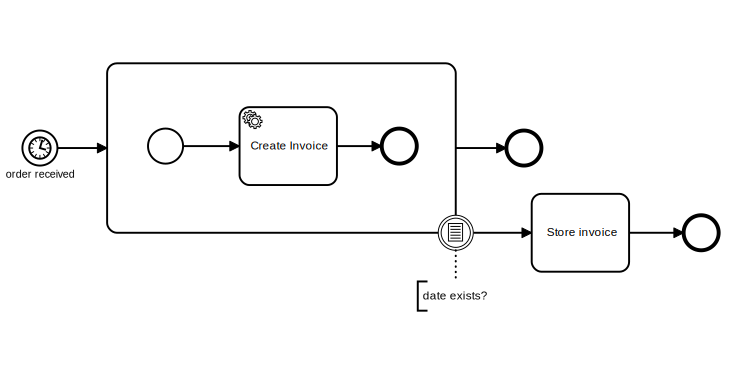

# Example
> NodeJS >= v8.9.4 is required



## Running the example

1. First, make sure to have [Camunda](https://camunda.com/download/) running.
 
2. Download the following [model](assets/order.bpmn) and deploy it using the Camunda Modeler.

3. Install Dependencies:

```sh
npm install
```

Or:

```sh
yarn
```

4. Run the example:
```sh
node index.js
```

### Output
The terminal output should be:
```
polling
✓ subscribed to topic invoiceCreator
polling
✓ polled 1 tasks
✓ completed task 21d19522-3e4c-11e8-b8df-186590db1cd7
polling
```
